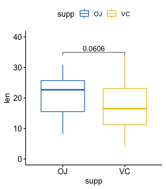
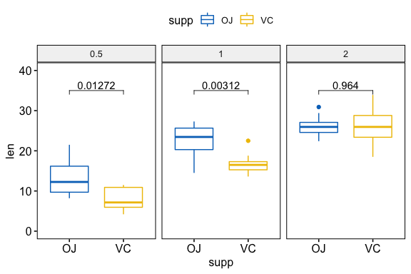
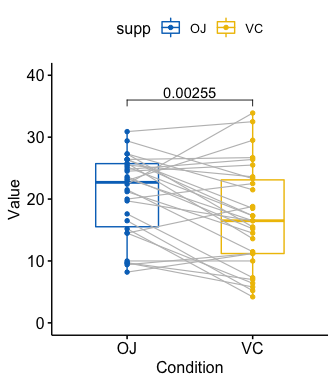
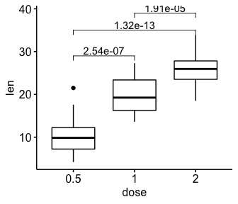
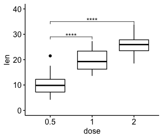
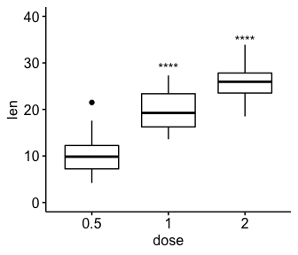
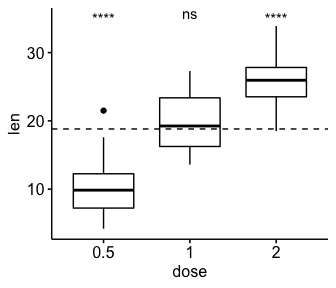

<!-- README.md is generated from README.Rmd. Please edit that file -->
[](https://travis-ci.org/kassambara/rstatix)

rstatix
=======

Provides a pipe-friendly framework to perform easily basic statistical tests in R. The output of each test is automatically transformed into a tidy data frame to facilitate visualization.

Key functions
-------------

### Descriptive statistics

-   `get_summary_stats()`: Compute summary statistics for one or multiple numeric variables. Can handle grouped data.
-   `identify_outliers()`: Detect outliers using boxplot methods.
-   `box_m()`: Box's M-test for homogeneity of covariance matrices

### Comparing means

-   `t_test()`: perform one-sample, two-sample and pairwise t-tests
-   `wilcox_test()`: perform one-sample, two-sample and pairwise Wilcoxon tests
-   `anova_test()`: wrapper around `car:Anova()` to perform Anova test
-   `kruskal_test()`: perform kruskal-wallis rank sum test
-   `tukey_hsd()` and `tukey_hsd2()`: performs tukey post-hoc tests

### Effect Size

-   `cohens_d()`: Compute cohen's d measure of effect size for t-tests.
-   `eta_squared()` and `partial_eta_squared()`: Compute effect size for ANOVA.

### Correlation analysis

**Computing correlation**:

-   `cor_test()`: correlation test between two or more variables using Pearson, Spearman or Kendall methods.
-   `cor_mat()`: compute correlation matrix with p-values. Returns a data frame containing the matrix of the correlation coefficients. The output has an attribute named "pvalue", which contains the matrix of the correlation test p-values.
-   `cor_get_pval()`: extract a correlation matrix p-values from an object of class `cor_mat()`.
-   `cor_pmat()`: compute the correlation matrix, but returns only the p-values of the correlation tests.
-   `as_cor_mat()`: convert a `cor_test` object into a correlation matrix format.

**Reshaping correlation matrix**:

-   `cor_reorder()`: reorder correlation matrix, according to the coefficients, using the hierarchical clustering method.
-   `cor_gather()`: takes a correlation matrix and collapses (or melt) it into long format data frame (paired list)
-   `cor_spread()`: spread a long correlation data frame into wide format (correlation matrix).

**Subsetting correlation matrix**:

-   `cor_select()`: subset a correlation matrix by selecting variables of interest.
-   `pull_triangle()`, `pull_upper_triangle()`, `pull_lower_triangle()`: pull upper and lower triangular parts of a (correlation) matrix.
-   `replace_triangle()`, `replace_upper_triangle()`, `replace_lower_triangle()`: replace upper and lower triangular parts of a (correlation) matrix.

**Visualizing correlation matrix**:

-   `cor_as_symbols()`: replaces the correlation coefficients, in a matrix, by symbols according to the value.
-   `cor_plot()`: visualize correlation matrix using base plot.
-   `cor_mark_significant()`: add significance levels to a correlation matrix.

### Adjusting p-values and adding significance symbols

-   `adjust_pvalue()`: add an adjusted p-values column to a data frame containing statistical test p-values
-   `add_significance()`: add a column containing the p-value significance level

### Others

-   `doo()`: alternative to dplyr::do for doing anything. Technically it uses `nest() + mutate() + map()` to apply arbitrary computation to a grouped data frame.

Installation and loading
------------------------

-   Install the latest version from [GitHub](https://github.com/kassambara/rstatix) as follow:

``` r
# Install
if(!require(devtools)) install.packages("devtools")
devtools::install_github("kassambara/rstatix")
```

-   Loading packages

``` r
library(rstatix)  
library(ggpubr)  # For easy data-visualization
```

Comparing means
---------------

To compare the means of two groups, you can use either the function `t_test()` (parametric) or `wilcox_test()` (non-parametric). In the following example the t-test will be illustrated.

### Data

Preparing the demo data set:

``` r
df <- ToothGrowth
df$dose <- as.factor(df$dose)
head(df)
#>    len supp dose
#> 1  4.2   VC  0.5
#> 2 11.5   VC  0.5
#> 3  7.3   VC  0.5
#> 4  5.8   VC  0.5
#> 5  6.4   VC  0.5
#> 6 10.0   VC  0.5
```

### Compare two independent groups

-   Create a simple box plot with p-values:

``` r
# T-test
stat.test <- df %>% 
  t_test(len ~ supp, paired = FALSE) 
stat.test
#> # A tibble: 1 x 6
#>   .y.   group1 group2 statistic      p method
#>   <chr> <chr>  <chr>      <dbl>  <dbl> <chr> 
#> 1 len   OJ     VC          1.92 0.0606 T-test

# Create a box plot
p <- ggboxplot(
  df, x = "supp", y = "len", 
  color = "supp", palette = "jco", ylim = c(0,40)
  )
# Add the p-value manually
p + stat_pvalue_manual(stat.test, label = "p", y.position = 35)
```



-   Customize labels using [glue expression](https://github.com/tidyverse/glue):

``` r
p +stat_pvalue_manual(stat.test, label = "T-test, p = {p}", 
                      y.position = 36)
```


-   Grouped data: compare supp levels after grouping the data by "dose"

``` r
# Statistical test
stat.test <- df %>%
  group_by(dose) %>%
  t_test(len ~ supp) %>%
  adjust_pvalue() %>%
  add_significance("p.adj")
stat.test
#> # A tibble: 3 x 9
#>   dose  .y.   group1 group2 statistic       p method   p.adj p.adj.signif
#>   <fct> <chr> <chr>  <chr>      <dbl>   <dbl> <chr>    <dbl> <chr>       
#> 1 0.5   len   OJ     VC        3.17   0.00636 T-test 0.0127  *           
#> 2 1     len   OJ     VC        4.03   0.00104 T-test 0.00312 **          
#> 3 2     len   OJ     VC       -0.0461 0.964   T-test 0.964   ns

# Visualization
ggboxplot(
  df, x = "supp", y = "len",
  color = "supp", palette = "jco", facet.by = "dose",
  ylim = c(0, 40)
  ) +
  stat_pvalue_manual(stat.test, label = "p.adj", y.position = 35)
```



### Compare paired samples

``` r
# T-test
stat.test <- df %>% 
  t_test(len ~ supp, paired = TRUE) 
stat.test
#> # A tibble: 1 x 6
#>   .y.   group1 group2 statistic       p method
#>   <chr> <chr>  <chr>      <dbl>   <dbl> <chr> 
#> 1 len   OJ     VC          3.30 0.00255 T-test

# Box plot
p <- ggpaired(
  df, x = "supp", y = "len", color = "supp", palette = "jco", 
  line.color = "gray", line.size = 0.4, ylim = c(0, 40)
  )
p + stat_pvalue_manual(stat.test, label = "p", y.position = 36)
```



### Compare more than two groups

-   Pairwise comparisons: if the grouping variable contains more than two categories, a pairwise comparison is automatically performed.

``` r
# Pairwise t-test
pairwise.test <- df %>% t_test(len ~ dose)
pairwise.test
#> # A tibble: 3 x 9
#>   .y.   group1 group2 statistic        p method    p.adj p.signif
#>   <chr> <chr>  <chr>      <dbl>    <dbl> <chr>     <dbl> <chr>   
#> 1 len   0.5    1          -6.48 1.27e- 7 T-test 2.54e- 7 ****    
#> 2 len   0.5    2         -11.8  4.40e-14 T-test 1.32e-13 ****    
#> 3 len   1      2          -4.90 1.91e- 5 T-test 1.91e- 5 ****    
#> # … with 1 more variable: p.adj.signif <chr>
# Box plot
ggboxplot(df, x = "dose", y = "len")+
  stat_pvalue_manual(
    pairwise.test, label = "p.adj", 
    y.position = c(29, 35, 39)
    )
```



-   Multiple pairwise comparisons against reference group: each level is compared to the ref group

``` r
# Comparison against reference group
#::::::::::::::::::::::::::::::::::::::::
# T-test: each level is compared to the ref group
stat.test <- df %>% t_test(len ~ dose, ref.group = "0.5")
stat.test
#> # A tibble: 2 x 9
#>   .y.   group1 group2 statistic        p method    p.adj p.signif
#>   <chr> <chr>  <chr>      <dbl>    <dbl> <chr>     <dbl> <chr>   
#> 1 len   0.5    1          -6.48 1.27e- 7 T-test 1.27e- 7 ****    
#> 2 len   0.5    2         -11.8  4.40e-14 T-test 8.80e-14 ****    
#> # … with 1 more variable: p.adj.signif <chr>
# Box plot
ggboxplot(df, x = "dose", y = "len", ylim = c(0, 40)) +
  stat_pvalue_manual(
    stat.test, label = "p.signif", 
    y.position = c(29, 35)
    )
```



``` r
# Remove bracket
ggboxplot(df, x = "dose", y = "len", ylim = c(0, 40)) +
  stat_pvalue_manual(
    stat.test, label = "p.signif", 
    y.position = c(29, 35),
    remove.bracket = TRUE
    )
```



-   Multiple pairwise comparisons against all (base-mean): Comparison of each group against base-mean.

``` r
# T-test
stat.test <- df %>% t_test(len ~ dose, ref.group = "all")
stat.test
#> # A tibble: 3 x 9
#>   .y.   group1 group2 statistic       p method   p.adj p.signif
#>   <chr> <chr>  <chr>      <dbl>   <dbl> <chr>    <dbl> <chr>   
#> 1 len   all    0.5        5.82  2.90e-7 T-test 8.70e-7 ****    
#> 2 len   all    1         -0.660 5.12e-1 T-test 5.12e-1 ns      
#> 3 len   all    2         -5.61  4.25e-7 T-test 8.70e-7 ****    
#> # … with 1 more variable: p.adj.signif <chr>
# Box plot with horizontal mean line
ggboxplot(df, x = "dose", y = "len") +
  stat_pvalue_manual(
    stat.test, label = "p.signif", 
    y.position = 35,
    remove.bracket = TRUE
    ) +
  geom_hline(yintercept = mean(df$len), linetype = 2)
```



### Related articles

-   [Add P-values and Significance Levels to ggplots](http://www.sthda.com/english/articles/24-ggpubr-publication-ready-plots/76-add-p-values-and-significance-levels-to-ggplots/)
