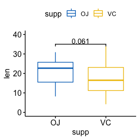
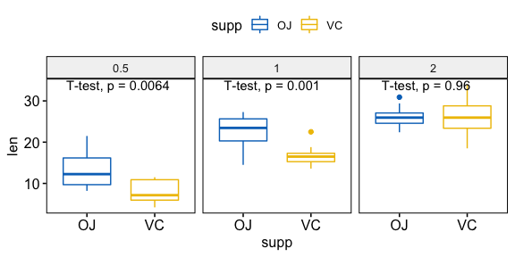

<!-- README.md is generated from README.Rmd. Please edit that file -->
[](https://travis-ci.org/kassambara/rstatix)

rstatix
=======

Provides a pipe-friendly framework to perform easily basic statistical tests in R. The output of each test is automatically transformed into a tidy data frame to facilitate visualization.

Main functions include:

-   `t_test()`: performs one-sample, two-sample and pairwise t-tests
-   `wilcox_test()`: performs one-sample, two-sample and pairwise Wilcoxon tests
-   `adjust_pvalue()`: add an adjusted p-values column to a data frame containing statistical test p-values
-   `add_significance()`: add a column containing the p-value significance level

Installation and loading
------------------------

-   Install the latest version from [GitHub](https://github.com/kassambara/rstatix) as follow:

``` r
# Install
if(!require(devtools)) install.packages("devtools")
devtools::install_github("kassambara/rstatix")
```

-   Loading packages

``` r
library(rstatix)  
library(ggpubr)  
```

Comparing means
---------------

### Comparing two groups

-   Two sample t-test

``` r
ToothGrowth %>% 
  t_test(len ~ supp, paired = FALSE)
#> # A tibble: 1 x 6
#>     .y. group1 group2 statistic     p method
#>   <chr>  <chr>  <chr>     <dbl> <dbl>  <chr>
#> 1   len     OJ     VC  1.915268 0.061 T-test

ToothGrowth %>%  ggboxplot(
  x = "supp", y = "len",
  color = "supp", palette = "jco"
  )
```



-   Compare supp levels after grouping the data by "dose"

``` r
# Statistical test
ToothGrowth %>%
  group_by(dose) %>%
  t_test(data =., len ~ supp) %>%
  adjust_pvalue() %>%
  add_significance("p.adj")
#> # A tibble: 3 x 9
#>    dose   .y. group1 group2  statistic      p method  p.adj p.adj.signif
#>   <dbl> <chr>  <chr>  <chr>      <dbl>  <dbl>  <chr>  <dbl>        <chr>
#> 1   0.5   len     OJ     VC  3.1697328 0.0064 T-test 0.0128            *
#> 2   1.0   len     OJ     VC  4.0327696 0.0010 T-test 0.0030           **
#> 3   2.0   len     OJ     VC -0.0461361 0.9600 T-test 0.9600           ns

# Visualization
ggboxplot(
  ToothGrowth, x = "supp", y = "len",
  color = "supp", palette = "jco",facet.by = "dose"
  ) +
  stat_compare_means(method = "t.test")
```



-   Pairwise comparisons

``` r
# pairwise comparisons
#::::::::::::::::::::::::::::::::::::::::
# As dose contains more thant two levels ==>
# pairwise test is automatically performed.
ToothGrowth %>% t_test(len ~ dose)
#> # A tibble: 3 x 9
#>     .y. group1 group2  statistic       p method   p.adj p.signif
#>   <chr>  <chr>  <chr>      <dbl>   <dbl>  <chr>   <dbl>    <chr>
#> 1   len    0.5      1  -6.476648 1.3e-07 T-test 2.6e-07     ****
#> 2   len    0.5      2 -11.799046 4.4e-14 T-test 1.3e-13     ****
#> 3   len      1      2  -4.900484 1.9e-05 T-test 1.9e-05     ****
#> # ... with 1 more variables: p.adj.signif <chr>

# Comparison against reference group
#::::::::::::::::::::::::::::::::::::::::
# each level is compared to the ref group
ToothGrowth %>% t_test(len ~ dose, ref.group = "0.5")
#> # A tibble: 2 x 9
#>     .y. group1 group2  statistic       p method   p.adj p.signif
#>   <chr>  <chr>  <chr>      <dbl>   <dbl>  <chr>   <dbl>    <chr>
#> 1   len    0.5      1  -6.476648 1.3e-07 T-test 1.3e-07     ****
#> 2   len    0.5      2 -11.799046 4.4e-14 T-test 8.8e-14     ****
#> # ... with 1 more variables: p.adj.signif <chr>

# Comparison against all
#::::::::::::::::::::::::::::::::::::::::
ToothGrowth %>% t_test(len ~ dose, ref.group = "all")
#> # A tibble: 3 x 9
#>     .y. group1 group2  statistic       p method   p.adj p.signif
#>   <chr>  <chr>  <chr>      <dbl>   <dbl>  <chr>   <dbl>    <chr>
#> 1   len    all    0.5  5.8222543 2.9e-07 T-test 8.7e-07     ****
#> 2   len    all      1 -0.6600185 5.1e-01 T-test 5.1e-01       ns
#> 3   len    all      2 -5.6094267 4.3e-07 T-test 8.7e-07     ****
#> # ... with 1 more variables: p.adj.signif <chr>
```
